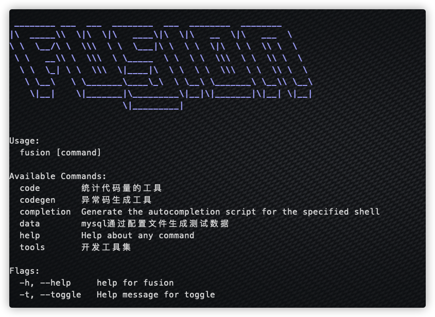
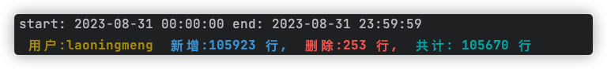
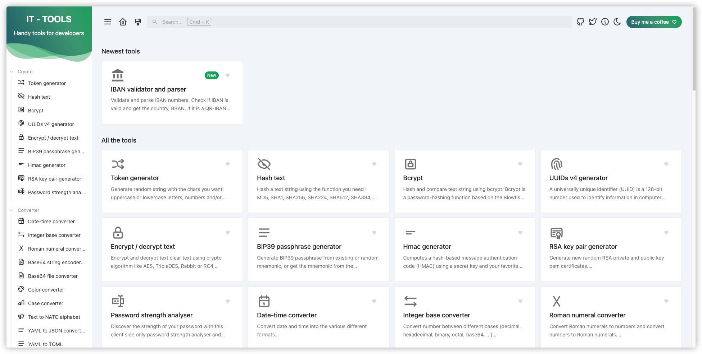
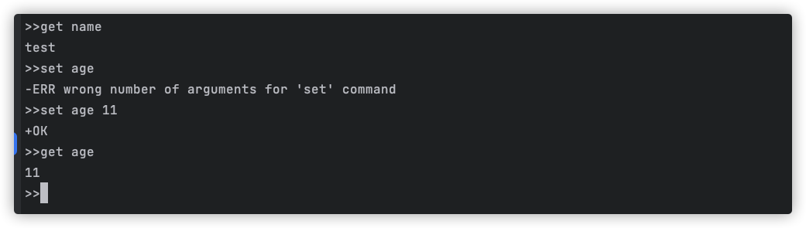

# 1. 简介

一个简单的工具集，像一个融合怪（fusion monster）一样，缝合一些常用的功能。


## 2. 安装

* 方式一：

  ```shell
  go install github.com/laoningmeng/fusion@latest
  ```

* 方式二：

  ```shell
  make build
  ```

  可执行文件在`/bin` 目录, 将可执行文件加入环境变量即可

设置完毕命令行输入


```shell
fusion 
```

出现如下图内容表示成功




# 3. 功能列表

* `code` : 统计代码量

* `data`: 生成测试数据

* `codegen`: 异常码生成

* `tools` 开发常用工具箱

* `redis` redis-cli 工具

  

### 3.1  统计代码量


```shell
fusion code
```
输出:



### 3.2 生成mysql测试数据


这里的数据源是融合的是 `brianvoe/gofakeit` 
使用：
首先创建mysql 连接和表结构的配置文件


```yaml
data:
  mysql:
    host: 127.0.0.1
    username: root
    password: 123456
    db: db_name
    port: 3306
  tables:
    user:
      _number: 100
      name: Name
      age: Number-0-100
      gender: Number-0-1
    city:
      _number: 200
      name: City
```

上面的字段譬如`gender` ,调用的是Number方法，参数是0,1 ,data 工具是利用反射调用的gofakeit， 所以函数可以去对应仓库去找

```yaml
fusion data  -c data.yml -s 1000
```
* `-c` 指定配置文件路径
* `-s` 指定批量插入时的数量, 默认100


### 3.3  codegen 异常码生成工具


这里融合的是`marmotedu/iam` 项目的tools里的其中的codegen

使用
```go
package code

//go:generate codegen --type=int
//go:generate codegen --type=int -d -o ./error_code_generated.md

// 通用: 基本错误
// Code must start with 1xxxxx
const (
	// ErrSuccess - 200: OK.
	ErrSuccess int = iota + 100001

	// ErrUnknown - 500: Internal server error.
	ErrUnknown

	// ErrBind - 400: Error occurred while binding the request body to the struct.
	ErrBind

	// ErrValidation - 400: Validation failed.
	ErrValidation

	// ErrTokenInvalid - 401: Token invalid.
	ErrTokenInvalid
)
```
生成
```shell
go generate code.go
```


### 3.4  常用工具箱


开发中常用一些时间转化，json格式化，加解密的功能，这里融合的是
`CorentinTh/it-tools` 

启动
```shell
fusion tools 
```
也可以指定端口
```shell
fusion tools -p 8090
```




### 3.5 redis-cli
 一个简单的redis 命令行工具
```shell
fusion redis -host 127.0.0.1 -port=6379 --pass=xxx db=0
```
因为设置了默认值，如果redis 没有账号密码，host是127.0.0.1， port 6379
可以直接运行
```shell
fusion redis
```



